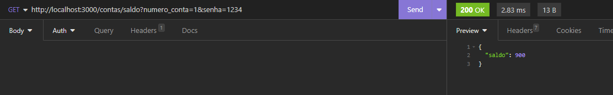

# API RESTful para um sistema bancário

O papel desta API em um banco é criar contas bancárias, listar todas as contas armazenadas, atualizar os dados do cliente, excluir contas quando necessário, permitir depósitos, saques, transferências entre contas do banco, consultar saldo e emitir extratos referentes às contas.

## Endpoints

### Listar contas bancárias

#### `GET` `http://localhost:3000/contas?senha_banco=Cubos123Bank`

Este endpoint lista todas as contas bancárias existentes. Para obter a lista, é necessário incluir a senha "Cubos123Bank" nos parâmetros de consulta.

- **Requisição** - parâmetros de consulta (respeitando estes nomes):
  - senha_banco

- **Resposta**
  - listagem de todas as contas bancárias existentes

### Criar conta bancária

#### `POST` `http://localhost:3000/contas`

Este endpoint cria uma conta bancária, gerando um número único para identificação da conta.

- **Requisição** - O corpo (body) ira possuir um objeto com as seguintes propriedades (respeitando estes nomes):

  - nome
  - cpf
  - data_nascimento
  - telefone
  - email
  - senha

- **Resposta**

  Em caso de **sucesso**, não haverá conteúdo no corpo (body) da resposta. 
  Em caso de **falha na validação**, a resposta terá o status code apropriado e um objeto no corpo (body) com uma propriedade mensagem explicando o motivo da falha.

  

### Atualizar usuário da conta bancária

#### `PUT` `http://localhost:3000/contas/:numeroConta/usuario`

Esse endpoint ira atualizar apenas os dados do usuário de uma conta bancária.

- **Requisição** - O corpo (body) irá possuir um objeto com todas as seguintes propriedades (respeitando estes nomes):

  - nome
  - cpf
  - data_nascimento
  - telefone
  - email
  - senha

- **Resposta**

  Em caso de **sucesso**, não haverá conteúdo no corpo (body) da resposta.
  Em caso de **falha na validação**, a resposta terá o status code apropriado e um objeto no corpo (body) com uma propriedade mensagem explicando o motivo da falha.

 

### Excluir Conta

#### `DELETE` `http://localhost:3000/contas/:numeroConta`

Esse endpoint ira excluir uma conta bancária existente.

- **Requisição**

  - Numero da conta bancária (passado como parâmetro na rota)

- **Resposta**

  Em caso de **sucesso**, não haverá conteúdo no corpo (body) da resposta.
  Em caso de **falha na validação**, a resposta terá o status code apropriado e um objeto no corpo (body) com uma propriedade mensagem explicando o motivo da falha.

### Depositar

#### `POST` `http://localhost:3000/transacoes/depositar`

Este endpoint soma o valor do depósito ao saldo de uma conta válida e registra essa transação.

- **Requisição** - O corpo (body) deve conter um objeto com as seguintes propriedades (respeitando estes nomes):

  - numero_conta
  - valor

- **Resposta**

  Em caso de **sucesso**, não haverá conteúdo no corpo (body) da resposta.
  Em caso de **falha na validação**, a resposta terá o status code apropriado e um objeto no corpo (body) com uma propriedade mensagem explicando o motivo da falha.

### Sacar

Este endpoint realiza o saque de um valor em uma determinada conta bancária e registra essa transação.

#### `POST` `http://localhost:3000/transacoes/sacar`

- **Requisição** - O corpo (body) ira possuir um objeto com as seguintes propriedades (respeitando estes nomes):

  - numero_conta
  - valor
  - senha

- **Resposta**

  Em caso de **sucesso**, não haverá conteúdo no corpo (body) da resposta.
  Em caso de **falha na validação**, a resposta terá o status code apropriado e um objeto no corpo (body) com uma propriedade mensagem explicando o motivo da falha.

### Tranferir

#### `POST` `http://localhost:3000/transacoes/transferir`

Este endpoint permite a transferência de recursos (dinheiro) de uma conta bancária para outra e registra essa transação.

- **Requisição** - O corpo (body) ira possuir um objeto com as seguintes propriedades (respeitando estes nomes):

  - numero_conta_origem
  - numero_conta_destino
  - valor
  - senha

- **Resposta**

  Em caso de **sucesso**, não haverá conteúdo no corpo (body) da resposta.
  Em caso de **falha na validação**, a resposta terá o status code apropriado e um objeto no corpo (body) com uma propriedade mensagem explicando o motivo da falha.

### Saldo

#### `GET` `/contas/saldo?numero_conta=123&senha=123`

Este endpoint retorna o saldo de uma conta bancária.

- **Requisição** -  parâmetros de consulta:

  - numero_conta
  - senha

- **Resposta**

  - Saldo da conta

### Extrato

#### `GET` `http://localhost:3000/contas/extrato?numero_conta=123&senha=123`

Este endpoint lista as transações realizadas em uma conta específica.

- **Requisição** -  parâmetros de consulta:

  - numero_conta
  - senha

- **Resposta**
  - Relatório da conta

